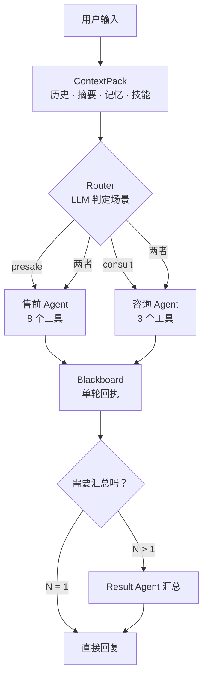
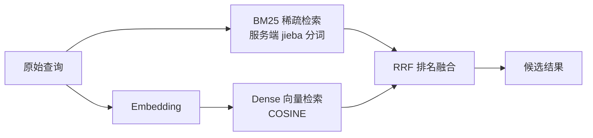

<div align="center">
  

  <h1>PickWise · 智能 3C 选购决策助手</h1>
  <p><strong>纯 Python 编排 · 手写 ReAct · 不依赖 LangChain / LangGraph · 7 个直接依赖</strong></p>
  <p>让每一次 3C 选购，都更明智。</p>

  <p>
    
    
    
    
    
    
  </p>
</div>

---

## 🎯 项目简介

PickWise 是一个面向 3C 消费场景的选购决策助手。它通过 **手写 ReAct 循环与多 Agent 编排**，把需求理解、工具调用、知识检索、上下文记忆和结果整合组织成一条可控制、可评测的执行路径。

它不依赖 LangChain / LangGraph 等 Agent 编排框架。编排逻辑由项目自身实现，并尽量让关键行为具备明确的边界、失败路径和可验证的规则。

> **核心设计：单 Agent 与多 Agent 不是两套模式，而是同一条执行路径的两个特例。** 当任务只需要一个 Agent（N = 1）时直接返回；需要多个 Agent 时，再由 Result Agent 汇总各自回执。

## 🧭 目录导航

- [项目亮点](#-项目亮点) · [系统架构](#-系统架构) · [工程设计](#-三个不那么显然的工程设计)
- [工具调用安全](#-工具体系与调用安全) · [混合检索](#-检索dense--bm25-混合检索) · [评估体系](#-评估体系)
- [韧性设计](#-韧性设计明确每一层的责任边界) · [记忆机制](#-记忆机制) · [快速开始](#-快速开始)
- [项目结构](#-项目结构) · [测试](#-测试) · [技术栈](#-技术栈) · [已知事项](#-已知事项与限制)

## ✨ 项目亮点

| 亮点 | 设计价值 |
|---|---|
| 🧭 **统一编排路径** | Router 负责场景判定，Orchestrator 统一调度；N = 1 直返，N > 1 汇总。 |
| 🛠️ **原生工具调用** | 使用 OpenAI 兼容协议的 function calling；工具 schema 同时服务模型提示与执行前校验。 |
| 🔎 **混合检索** | Dense 向量检索与 BM25 稀疏检索并行执行，再通过 RRF 融合排名。 |
| 🧠 **分层记忆** | STM 维护近期交互上下文，LTM 持久化长期事实，并在会话关闭时进行巩固。 |
| 🛡️ **韧性设计** | 区分瞬时故障与上下文溢出，限制重复工具调用，避免把不完整输出当成最终答案。 |
| 🧪 **可重复评测** | 规则断言决定用例是否通过；LLM-as-judge 只作参考，测试使用隔离 session 与本地 mock。 |

## 🏗️ 系统架构



### 一轮请求如何执行

1. **ContextPack**：组合近期历史、摘要、长期记忆与可用技能，为本轮执行准备上下文。
2. **Router**：根据用户意图判断场景，选择售前 Agent、咨询 Agent，或同时选择两者。
3. **SubAgent**：沿着手写 ReAct 循环执行推理与工具调用；每个 Agent 只能看到自己的工具白名单。
4. **Blackboard**：收集各 Agent 的单轮执行回执，包括成功结果或失败信息。
5. **结果交付**：只运行一个 Agent 时直接返回；多个 Agent 参与时由 Result Agent 汇总已有结果，并如实说明未完成的部分。

## 💡 三个不那么显然的工程设计

### 1. 历史视图投影：不让 Agent 模仿邻居的工具调用

共享历史可能包含其他 Agent 的 `tool_calls`。如果模型看到邻居调用过某工具，可能会模仿调用；但执行层的工具白名单必然拒收，白白消耗额外的 LLM 轮次。

PickWise 会按**完整消息块**处理历史：将一条 `assistant(tool_calls)` 及其后连续的 tool 消息作为整体判定。当块内工具全部越权时，将整块折叠为中性文本，而不是只删除某一条消息。

- 折叠后的文本不暴露具体工具名。
- 文案按语义类别生成，例如检索、对比或用户偏好。
- 不把“读取用户收藏夹”模糊描述成“完成信息检索”，避免后续 Agent 误以为必要检索已经完成。

> **工程取舍：文案失真导致的错误认知，可能比工具名泄漏更昂贵。** 因此，历史投影既要隔离工具权限，也要尽可能保留真实语义。

### 2. 上下文压缩是事务，而不是原地删消息

压缩流程遵循“先计算、后提交”的原则：

1. 生成候选摘要，不立即修改原始状态。
2. 确认压缩结果确实比原上下文更小。
3. 只有在前两步成功后，才删除被覆盖的历史前缀并替换 summary。
4. 任一步失败，都保留原状态，避免上下文被破坏。

切点从最新消息向前累积 token，并且只在 user turn 起点切分，避免拆开 `user → assistant(tool_calls) → tool → assistant` 这样的完整调用链。若摘要本身过长，则再次压缩摘要；宁可舍弃部分叙述性细节，也不让压缩失败拖垮整次请求。

### 3. HTTP 200 不代表模型完成了任务

即使 API 返回 HTTP 200，以下情况仍不能视为有效的最终答复：

- 回复内容为空；
- `finish_reason = length`，表示输出被截断；
- 响应仍携带 `tool_calls`，表示模型仍希望继续调用工具。

任一条件成立，都视为“模型未返回完整有效的最终答复”，进入对应的降级路径。这样可以避免将空白、不完整或尚未执行完工具调用的内容直接交付给用户。

## 🧰 工具体系与调用安全

PickWise 使用 OpenAI 原生 function calling，并以 `TOOL_DEFINITIONS` 作为 schema 单一事实来源：

```text
TOOL_DEFINITIONS
      │
      └── 派生 → _SCHEMA_MAP → 执行前参数校验
      │                            │
      └── 提供给模型的工具说明 ────┘
```

模型看到的工具定义和执行层的参数约束来自同一份 schema，减少“模型以为可以调用、执行层却按另一套规则校验”的契约漂移。参数不符合契约时，错误会回馈给模型，让它尝试修正，而不是直接结束任务。

### 三道闸门

| 顺序 | 闸门 | 作用 |
|---|---|---|
| ① | **协议层** | 解析 JSON，检查工具参数能否被正确读取。 |
| ② | **契约层** | 依据 schema 校验参数与字段约束。 |
| ③ | **重复调用熔断** | 同一参数签名第 3 次调用时拦截，并提示模型更换查询条件或基于现有信息作答。 |

重复调用签名使用参数归一化后的稳定 JSON 计算，因此仅把参数从 `"10"` 改写成 `10`，不能绕过熔断。参数归一化与签名的实际实现以代码为准。

### Agent 工具白名单

| Agent | 场景 | 可用工具数 |
|---|---|---:|
| `presale` | 售前选购 | 8 |
| `consult` | 售前咨询 | 3 |

工具权限通过**按 Agent 裁剪 function schema** 实现硬隔离，而不是依靠 prompt 请求模型自觉遵守。上表表示各 Agent 的可用工具规模，不代表两组工具一定完全不重叠。

## 🔍 检索：Dense + BM25 混合检索

知识库与商品库均使用 Milvus 混合检索，并在服务端通过 Reciprocal Rank Fusion（RRF）融合稀疏与稠密检索的排名。



**为什么 BM25 使用原始查询？** 只有 retriever 层同时持有查询原文和 embedder，因此原文透传放在 retriever 层处理，而不额外耦合到更上层的编排代码。

**为什么生产检索与评测共用实现？** 让真实请求和检索评测经过同一条检索路径，减少“离线测的是一套逻辑、生产跑的是另一套逻辑”的偏差。

默认使用 **Milvus Lite**，数据存储在本地 `.db` 文件中，无需单独部署服务；需要切换到 Milvus Standalone 时，可通过配置 URI 切换。具体配置项以 `.env.example` 和 `app/config/settings.py` 为准。

## 🧪 评估体系

> **规则断言决定通过与否，LLM-as-judge 只提供参考。**

`CaseResult.passed` 只由确定性规则决定。评审模型输出可能存在波动，不应成为自动化评测的最终开关。

### 评测数据集：共 231 条用例

| 数据集 | 数量 | 覆盖内容 |
|---|---:|---|
| `cases.json` | 20 | 端到端流程，含多轮指代消解 |
| `router_cases.json` | 55 | 场景路由，包含 group / difficulty 维度 |
| `rag_cases.json` | 152 | 检索质量，仅使用人工审核的标注 |
| `cases_isolation.json` | 4 | 工具白名单泄漏探针 |
| **合计** | **231** | — |

### 运行评测

```bash
# 端到端评测（20 条）
python app/scripts/run_eval.py

# Router 专项评测（55 条）
python app/scripts/run_router_eval.py

# RAG 检索评测：Hit@K / MRR / Recall@K
python app/scripts/run_rag_eval.py --top-k 5

# 判分器自检
python app/scripts/run_eval.py --self-test
```

### 评测设计中的关键约束

- **Sandbox 隔离**：每条用例使用独立临时 session，关闭记忆读写，防止历史长期记忆注入 prompt 干扰评分；关闭 MCP，仅使用本地 mock，保证 ground truth 可控。
- **不修改生产代码**：通过对共享的 `chat.completions.create` 打 monkey-patch 实现插桩，而不是为了评测改写生产路径。
- **判分器自身也要被测**：`--self-test` 构造含伪造 ID 或伪造价格的回复轨迹，检查判分器能否正确拒绝。
- **量化幻觉防御**：`valid_ids_only` 检查 ID 是否来自真实目录；`reply_prices_in_catalog` 检查回复价格是否存在于商品目录。
- **评测运行韧性**：`runtime` 断言避免把服务故障时的兜底文本算成成功的推荐答案。

## 🛡️ 韧性设计：明确每一层的责任边界

| 层级 | 负责 | 不负责 |
|---|---|---|
| SDK / HTTP | 超时、重试、退避 | 执行本地写操作 |
| Router | 瞬时故障时回退默认场景 | 保证降级后仍完整完成推荐 |
| SubAgent | 只接受非空且未截断的答复 | 把代码异常伪装成正常答案 |
| Result Agent | 整合已有成果 | 编造失败 Agent 未成功取得的结果 |
| 入口层 | 接纳结果、对失败轮次补答 | 因记忆或保存失败覆盖已经生成的答案 |

### 部分失败，不等于整体失败

- 单 Agent 任务失败时，直接将失败向上抛出。
- 多 Agent 任务中，失败记录写入 Blackboard，由 Result Agent 根据已有成果如实说明未完成部分。
- 故障 Agent 不做无意义的重复调用。
- 只有 `overflow` 子集会在上下文压缩成功后重试一次；如果压缩未能缩小上下文，则不重复执行同样大小的请求。

### 两类异常，分别处理

异常识别采用两个相互独立的维度：

- `is_transient`：连接错误、超时、限流和 5xx 等瞬时故障。
- `is_context_overflow`：`context_length_exceeded` 等上下文长度问题。

两类异常都收窄识别范围，遵循“宁可漏判，也不误判”的原则。参数错误不是上下文溢出，压缩无法修复参数错误；连接中断也不应默认触发上下文压缩。

## 🧠 记忆机制

PickWise 将短期上下文与长期记忆分开管理：

| 维度 | STM（短期记忆） | LTM（长期记忆） |
|---|---|---|
| 存储 | 进程内存 | 本地 JSON 文件 |
| 主要用途 | 保留近期对话上下文 | 巩固用户事实与长期偏好 |
| 更新时机 | 每轮成功后更新 | 会话关闭时巩固 |
| 边界 | 只保留最近 6 条消息 | 原子写入；提取失败不影响已生成的回答 |

记忆用于辅助后续交互，不应成为覆盖本轮有效答案的故障源。具体保留窗口与巩固时机如有调整，以实际配置和实现为准。

## 🚀 快速开始

### 环境要求

- Python 环境（请按项目实际依赖选择兼容版本）
- 一个支持 OpenAI 兼容协议的 LLM API Key
- 可用的 Embedding 服务：当主模型服务不提供 embedding 接口时，需要单独配置

除 LLM API 外，其他基础设施尽可能提供降级路径。Milvus 默认可使用本地 Milvus Lite；PostgreSQL 和 Langfuse 为可选服务，但当前版本的 Python 依赖有额外注意事项，详见下文。

### 1. 克隆仓库并安装依赖

```bash
git clone https://github.com/YW216/pickwise.git
cd pickwise

python -m venv .venv

# macOS / Linux
source .venv/bin/activate

# Windows PowerShell 可使用：
# .venv\Scripts\Activate.ps1

pip install -r requirements.txt

# 当前 requirements.txt 未声明，但启动 / 测试需要单独安装
pip install langfuse pytest
```

### 2. 配置环境变量

复制配置模板后，请先检查并移除 `Settings` 未声明的键，再填入自己的凭据：

```bash
cp .env.example .env
```

示例配置如下（请按实际模型服务修改）：

```ini
OPENAI_API_KEY=sk-你的模型服务密钥
OPENAI_BASE_URL=https://api.deepseek.com
MODEL_NAME=deepseek-v4-flash

# 检索所需的 Embedding 服务
# DeepSeek 官方不提供 embedding 接口；此处示例使用 SiliconFlow
EMBEDDING_BASE_URL=https://api.siliconflow.cn/v1
EMBEDDING_API_KEY=sk-你的Embedding服务密钥
EMBEDDING_MODEL=BAAI/bge-m3
```

> ⚠️ **配置注意**：`Settings` 使用 `pydantic-settings` 的 `extra_forbidden`。如果 `.env` 包含未声明的键，配置加载可能整体失败。不要未经检查就照抄模板中的所有变量。

### 3. 启动交互式会话

```bash
python main.py
```

交互式命令：

| 命令 | 功能 |
|---|---|
| `skills` | 列出可用技能 |
| `memory` | 查看记忆原文 |
| `reset` | 重置当前会话 |
| `quit` | 退出程序 |

### 外部服务：哪些是必需的？

| 服务 | 是否必需 | 未配置时的行为 |
|---|---|---|
| **LLM API** | ✅ 必需 | 无法完成推理与生成；入口会显式报告缺失配置。 |
| **Embedding API** | ⚠️ 检索必需 | 无法执行需要向量嵌入的检索。若主模型服务不支持 Embedding，必须单独配置。 |
| **Milvus** | 检索功能必需 | 默认使用 Milvus Lite 本地文件模式，无须单独部署 Milvus 服务。 |
| **PostgreSQL** | 可选 | 回退到本地 JSON 数据文件。 |
| **Langfuse** | 可选功能 | 追踪功能退化为 no-op；但目前 `orchestrator.py` 存在强 import，因此运行环境仍需安装 `langfuse`。 |
| **MCP 服务端** | 当前不启用 | 服务端已暂停，当前走本地工具路径。 |

## 📁 项目结构

```text
pickwise/
├── main.py
├── app/
│   ├── multi_agent/             # 编排层
│   │   ├── orchestrator.py      # 统一编排入口
│   │   ├── router.py            # LLM 场景判定与执行顺序整理
│   │   ├── agents.py            # 轻量 ReAct SubAgent
│   │   ├── context_pack.py      # 共享上下文与历史视图投影
│   │   └── blackboard.py        # 收集单轮 Agent 回执
│   ├── agent/                   # 能力层，不负责多 Agent 编排
│   │   ├── compaction.py        # 上下文压缩
│   │   ├── context_budget.py    # token 预算与异常分类
│   │   ├── tools/               # 工具定义、schema 与校验闸门
│   │   ├── memory/              # STM / LTM 与事实提取
│   │   ├── rag/                 # Milvus 混合检索
│   │   └── skills/              # SKILL.md 流程加载
│   ├── evaluation/              # sandbox、指标、判分与报告
│   ├── config/settings.py       # pydantic-settings 配置
│   └── scripts/                 # 评测入口
├── tests/                       # 自动化测试
├── requirements.txt
└── README.md
```

> 上述目录树是按项目职责整理的阅读导航。实际文件名或目录若与当前分支不一致，请以仓库内容为准。

**架构分层原则：编排层决定“谁来做、按什么顺序做”；能力层提供“具体怎么做”的工具、记忆与检索能力。** 两者职责分离，减少模块间的职责重叠。

## ✅ 测试

```bash
pytest tests/ -v
```

自动化测试刻意保持离线：不消耗真实模型 token，也不依赖外部网络。

- `test_resilience.py` 使用假 client 注入故障，验证降级路径。
- `test_llm_transport.py` 使用 `httpx.MockTransport` 模拟 HTTP 交互。
- 另有若干 `verify_*.py` 脚本会真实调用 LLM / Milvus，属于手动端到端验证，执行前请确认服务和凭据已配置。
- `tests/test_multi_agent.py` 是脚本式断言，不属于标准 pytest 收集的测试用例。

可离线验证的故障路径，才适合纳入可重复测试；生产依赖不可用时，不应该成为单元测试无法运行的理由。

## 🧱 技术栈

| 层级 | 组件 / 方案 | 用途 |
|---|---|---|
| Agent 编排 | 自研 Python 编排、手写 ReAct、`ThreadPoolExecutor` | 任务路由与协作；不依赖 LangChain / LangGraph |
| 模型接口 | `openai` SDK（OpenAI 兼容协议） | LLM 推理、生成与 function calling |
| Embedding | `BAAI/bge-m3`（可配置兼容服务） | 检索向量生成 |
| 检索 | Milvus + BM25 + Dense + RRF | 混合检索与排名融合 |
| 配置与校验 | Pydantic v2、`pydantic-settings` | 类型校验与配置管理 |
| 追踪 | Langfuse（可选） | 链路与调用观察 |
| 数据 | PostgreSQL（可选）与本地 JSON | 持久化与降级存储 |
| 测试 | pytest、`unittest.mock`、`httpx.MockTransport` | 离线验证与故障注入 |

## ⚠️ 已知事项与限制

- **凭据不硬编码**：密钥配置不设默认值，由 `.env` 或环境变量注入。缺少凭据时，在调用入口通过 `assert_openai_configured()` / `assert_embedding_configured()` 显式报错，而不是在 import 阶段崩溃。
- **Embedding 凭据回退有条件**：`EMBEDDING_*` 留空时可回退到主模型配置，但仅当主服务实际提供兼容的 Embedding 接口时成立。若使用不提供 Embedding 的模型服务，需要配置独立的 Embedding API。
- **依赖声明尚需补齐**：当前 `requirements.txt` 未声明 `langfuse` 和 `pytest`；启动应用与执行测试前需单独安装。
- **`.env.example` 需要核对**：配置使用 `extra_forbidden`，未声明变量可能导致整个配置加载失败。
- **MCP 服务端已暂停**：`mcp_server/server.py` 当前仅保留注释，客户端代码就绪，但现阶段执行路径降级为本地工具。
- **非 pytest 风格测试**：`tests/test_multi_agent.py` 使用脚本式断言，不会被 pytest 自动收集。
- **学习期草稿不属于应用入口**：根目录 `agentdemo.py`、`test.py`、`wtest.py` 是 function calling / 装饰器实验草稿；其中 `agentdemo.py` 当前不可运行。

## 🗺️ 规划方向

- [ ] 补齐运行与测试依赖声明，减少首次安装时的额外步骤。
- [ ] 清理并校验 `.env.example`，让配置模板与 `Settings` 字段保持一致。
- [ ] 持续完善 Router、RAG 与端到端评测集。
- [ ] 扩大故障注入覆盖范围，持续验证部分失败与上下文溢出路径。
- [ ] 恢复或重新设计 MCP 服务端集成方案。

## 🤝 贡献

欢迎通过 Issue 反馈问题、提出改进建议，或提交 Pull Request。涉及架构变更时，建议附上设计理由、测试方式与相应的评测结果。

## 📄 许可证

请以仓库中的 `LICENSE` 文件为准。如果仓库尚未添加许可证，请在发布前明确项目的授权方式。

---

<div align="center">
  <strong>PickWise</strong><br />
  <sub>理解需求 · 检索信息 · 协同推理 · 辅助决策</sub>
</div>
